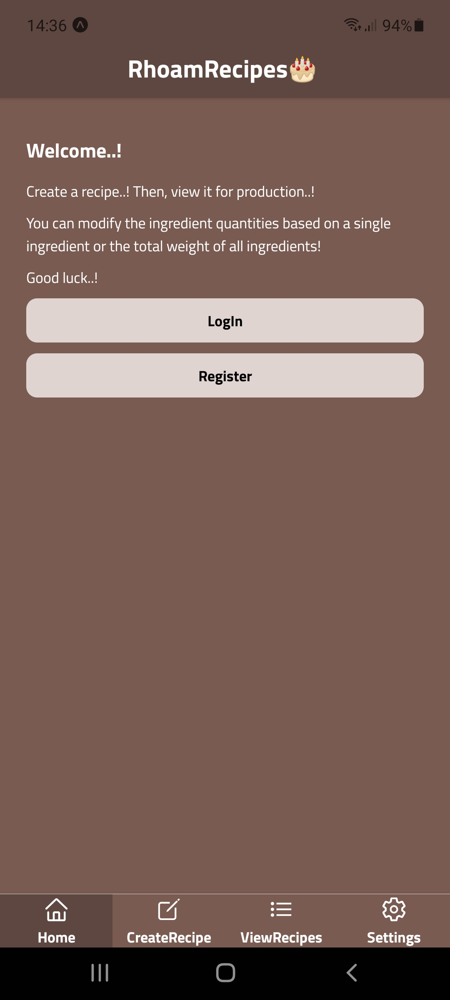
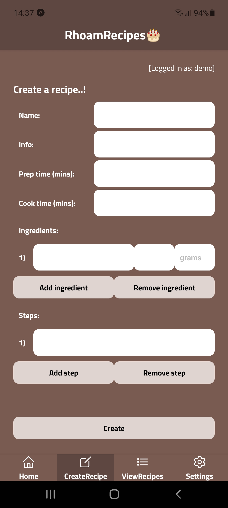
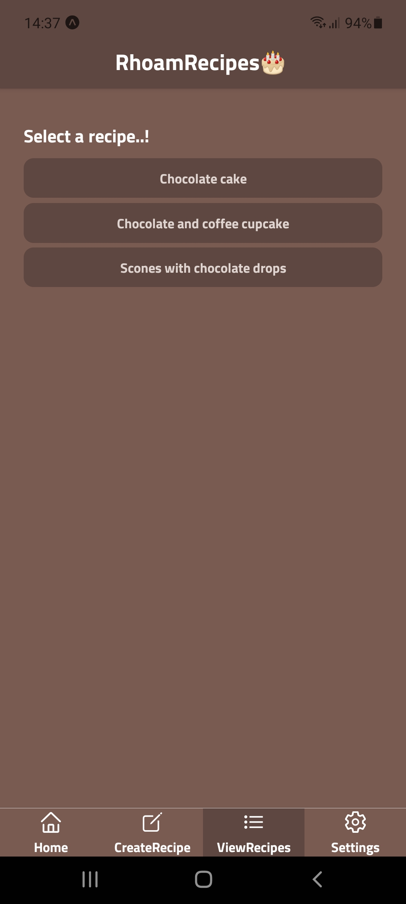
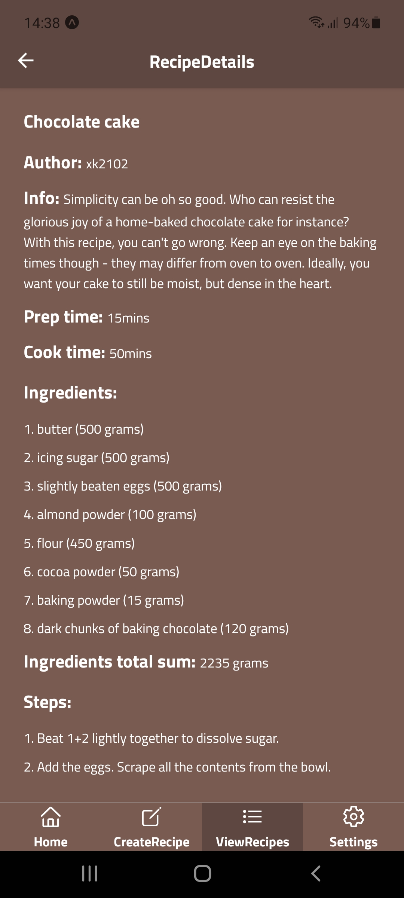
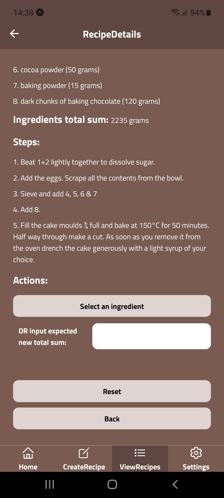
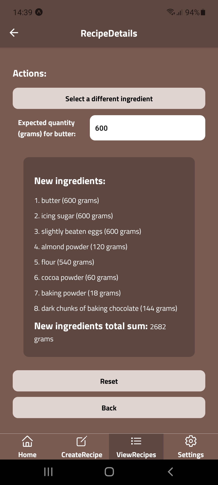

# rhoam-recipes-mobile

# RhoamRecipes

An app that intends to help pastry chefs who want to execute recipes on different quantities for production purposes.\
A React-Native app that connects to a RESTful API built with Express and MongoDB.

\*\* Please allow our dev servers 5-10 seconds to wake up..!

## Available features

You can create a recipe..! After logging in, you can save it in our API and view it for production.

When you select the recipe in the "View recipes" screen, you can choose to re-calculate (adjust) the ingredient portions based on

1. a specific ingredient
2. the total sum of ingredients.

